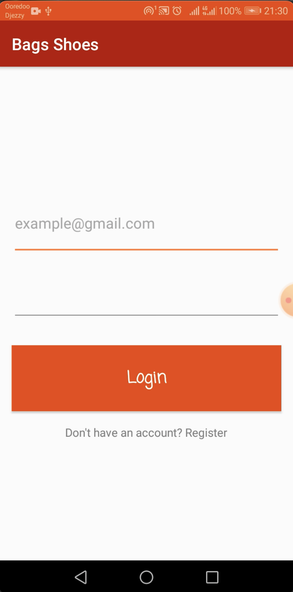

# 👜 **Bags & Shoes Store Android App** 📱

A native Android e-commerce application for a Bags and Shoes store, designed using the **MVVM** architecture pattern, with **Hilt** for dependency injection, **Retrofit** for networking, **Room** for local database storage, and **RxJava** for reactive programming. This app also includes **unit tests** to ensure code quality.

## 🚀 **Features**

- **MVVM Architecture** for clear separation of concerns
- **Hilt Dependency Injection** for efficient and scalable dependency management
- **Retrofit** for fast and efficient API networking
- **Room Database** for local offline storage of products and cart
- **RxJava** for reactive data handling and smooth UI updates
- **Unit Testing** for robust application testing and reliability
- User authentication (login, register, etc.)
- **Product Catalog** with category, price, and inventory filters
- **Cart Management** for adding/removing products
- **Smooth UI** designed for modern Android devices

## 🛠️ **Tech Stack**

| Technology           | Purpose                             |
|----------------------|-------------------------------------|
| **MVVM**             | Architecture pattern for separation of concerns |
| **Hilt**             | Dependency injection library        |
| **Retrofit**         | Networking library for API calls    |
| **Room**             | Local database for storing products and cart data |
| **RxJava**           | Reactive programming for API + local DB |
| **JUnit** / **Mockito** | Unit Testing for maintaining code quality |     |

## 📐 **App Architecture**

### **MVVM (Model-View-ViewModel)**
- **Model**: Handles data operations (API, local DB)
- **View**: UI components (Activities/Fragments)
- **ViewModel**: Interacts between View and Model, contains UI-related data

### **Room Database**
- **Entities**: `Product`, `Cart`, etc.
- **DAO**: Data access objects for handling product and cart data storage
- **Repositories**: Combine data from Retrofit API and Room Database

### **Retrofit**
- Handles network calls and responses, parsing JSON into Kotlin/Java objects
- Integrated with **RxJava** to handle asynchronous operations

### **Hilt**
- Used to inject dependencies like repositories, viewmodels, and services efficiently.

## ⚙️ **Setup Instructions**

### 1. Clone the repository
```bash
git clone https://github.com/your-username/bags-shoes-android-app.git
cd Bags-Shoes
```
## Screenshots




